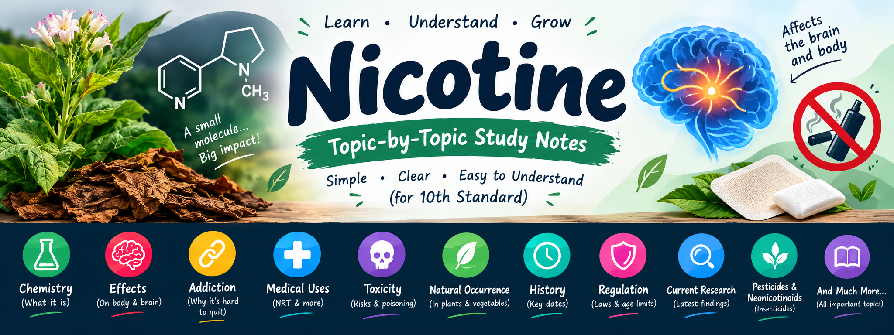
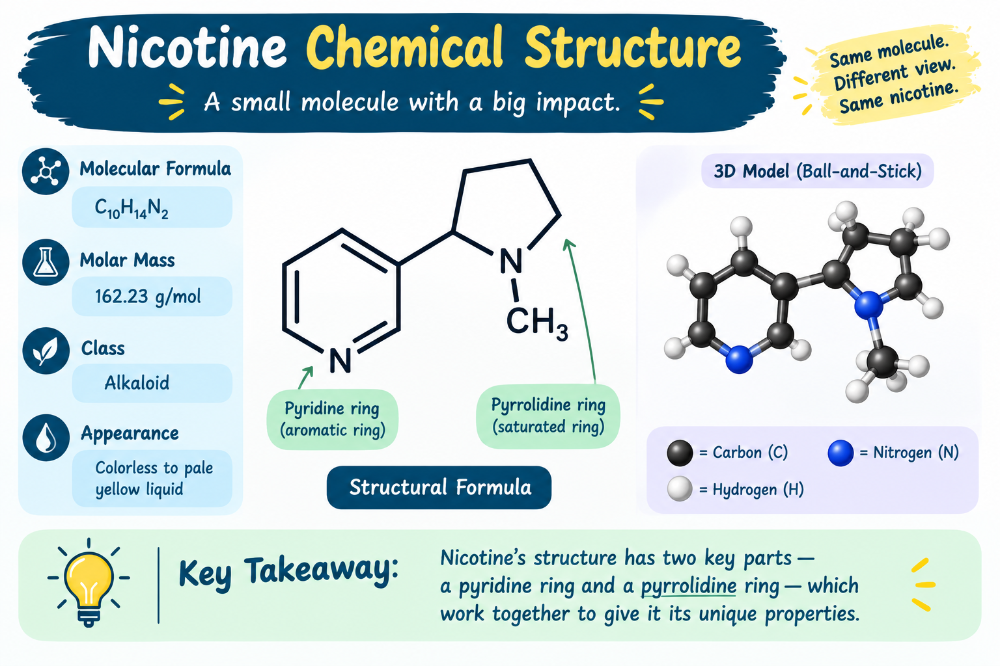

# Nicotine — Important Information

## 1. What is Nicotine?

- Nicotine is a **stimulant** (a substance that increases activity in the brain and body).
- It is an **alkaloid** (a naturally occurring nitrogen-containing chemical).
- It is mainly found in plants of the **nightshade family (Solanaceae)**, especially tobacco.
- Pure nicotine is a colorless to yellowish, oily liquid.
- It can easily pass through **biological membranes** (thin barriers surrounding cells).
- In insects, nicotine acts as a **neurotoxin** (poison that affects the nervous system).
- Nicotine is highly addictive.

## 2. How Does Nicotine Work?

- Nicotine attaches to **nicotinic acetylcholine receptors (nAChRs)**.
- These receptors are found in the brain and other parts of the body.
- Nicotine activates these receptors and affects the release of **neurotransmitters** (chemical messengers used by nerve cells).
- Important neurotransmitters affected include:
  - **Dopamine** — involved in reward and motivation.
  - **Acetylcholine** — involved in attention and nerve signalling.
  - **Norepinephrine** — involved in alertness and the stress response.
- These effects can produce increased alertness and sometimes mild **euphoria** (a feeling of pleasure or excitement).

## 3. Main Ways Nicotine Is Used

Nicotine can be delivered through:

- Cigarettes
- Cigars
- Chewing tobacco
- Snuff
- Snus
- E-cigarettes
- Nicotine pouches
- Nicotine gum
- Nicotine patches
- Lozenges
- Inhalers
- Nasal sprays

The method of delivery affects how quickly nicotine reaches the brain and can affect its addictive potential.

## 4. Nicotine and Cigarettes

- Nicotine is the main substance responsible for tobacco dependence.
- It provides **reinforcement** (making a person more likely to repeat a behaviour).
- Repeated exposure can cause **dependence** (the body or mind becoming used to a substance).
- Cigarette smoke also contains many other harmful chemicals, so the harmful effects of smoking cannot be explained by nicotine alone.

## 5. Nicotine Replacement Therapy (NRT)

**NRT** means giving nicotine without tobacco smoke to help a person stop smoking.

Examples include:

- Nicotine gum
- Nicotine patches
- Lozenges
- Inhalers
- Nasal sprays

NRT provides nicotine in controlled amounts and avoids the toxic products created by burning tobacco.

## 6. Why NRT Is Different From Smoking

- Faster nicotine delivery generally produces stronger reinforcement.
- NRT is designed to provide nicotine more slowly and in controlled amounts.
- NRT avoids exposure to many toxic chemicals produced when tobacco is burned.

## 7. Nicotine as an Insecticide

- Nicotine has been used as an **insecticide** (a chemical used to kill insects).
- It affects nicotinic acetylcholine receptors in insects.
- Nicotine insecticides became less common because newer insecticides were cheaper and less harmful to mammals.

## 8. Neonicotinoids

- **Neonicotinoids** are synthetic insecticides chemically related to nicotine.
- Example: **Imidacloprid**.
- Many neonicotinoids are **systemic** (absorbed into a plant and distributed through its tissues).

## 9. Nicotine and Attention

Research has found that nicotine can temporarily affect:

- Attention
- Alertness
- Fine motor performance
- Working memory
- Episodic memory

These effects do not mean nicotine is a safe study or performance-enhancing drug because nicotine is addictive and can have harmful effects.

## 10. Nicotine and Addiction

Nicotine is highly addictive.

Important terms:

- **Physical dependence** — the body adapts to nicotine.
- **Psychological dependence** — the mind develops a strong desire to use nicotine.
- **Tolerance** — needing repeated exposure to obtain the same effect.
- **Craving** — a strong desire to use nicotine.

Withdrawal can cause:

- Irritability
- Anxiety
- Poor concentration
- Low mood
- Sleep problems
- Tremor (shaking)
- Strong cravings

## 11. Nicotine and Dopamine

- Nicotine activates parts of the brain's **reward pathway** (a brain system involved in reward and motivation).
- It can increase dopamine release in this pathway.
- This helps explain why repeated nicotine use can become strongly reinforcing and addictive.

## 12. Nicotine and the Brain

### Short-term effects

Nicotine can:

- Increase alertness.
- Affect attention.
- Change mood.
- Increase dopamine activity.
- Change activity in certain brain circuits.

At very high exposure, nervous-system activity can become depressed (slowed down).

### Long-term exposure

Repeated nicotine exposure can cause changes in:

- Nicotinic receptors
- Dopamine pathways
- Reward-related brain circuits
- Gene-regulating proteins

## 13. Nicotine and the Sympathetic Nervous System

Nicotine activates the **sympathetic nervous system** (the part of the nervous system involved in the body's "fight-or-flight" response).

It can increase the release of adrenaline and norepinephrine.

This can increase:

- Heart rate
- Blood pressure
- Breathing rate
- Blood glucose

## 14. Nicotine and the Heart

Nicotine can:

- Increase heart rate.
- Temporarily increase blood pressure.
- Increase the workload of the heart.
- Cause **vasoconstriction** (narrowing of blood vessels).
- Affect blood flow.

Smoking causes additional cardiovascular harm because smoke contains many toxic substances besides nicotine.

## 15. Nicotine and Sleep

Nicotine can negatively affect sleep.

Research has found effects including reductions in:

- Total sleep time
- REM sleep
- Slow-wave sleep

Nicotine withdrawal can also cause sleep problems.

## 16. Nicotine Absorption and Speed

- Inhaled nicotine enters the bloodstream rapidly.
- After inhalation, nicotine can reach the brain in approximately 10–20 seconds.
- Rapid delivery contributes to the addictive potential of inhaled nicotine.

## 17. Nicotine Half-Life

- **Half-life** means the time required for the amount of a substance in the body to fall by half.
- Nicotine's half-life is about 2 hours.
- **Cotinine** (a major chemical produced when the body breaks down nicotine) remains much longer, with a half-life of roughly 18–20 hours.

## 18. How the Body Breaks Down Nicotine

- Most nicotine metabolism (chemical breakdown by the body) occurs in the liver.
- Important enzymes include:
  - CYP2A6
  - CYP2B6
  - FMO3
- A major product of nicotine breakdown is cotinine.

## 19. Nicotine and pH

- **pH** is a measure of how acidic or basic a substance is.
- Nicotine can exist in different chemical forms depending on pH.
- **Free-base nicotine** can pass through membranes readily.
- **Protonated nicotine** is nicotine carrying a positive charge.
- Acids can be added to nicotine to form **nicotine salts**.
- Nicotine salts are used in many modern vaping products.

## 20. Nicotine and Body Weight

Research shows nicotine can:

- Reduce hunger.
- Reduce food consumption.
- Increase energy expenditure (energy used by the body).

This does not make nicotine a safe weight-loss method.

## 21. Chemical Properties

- Molecular formula: **C₁₀H₁₄N₂**
- Molar mass: approximately **162.236 g/mol**
- Nicotine is a **chiral** molecule (a molecule that can exist in two mirror-image forms).
- It is an oily liquid.
- It can gradually turn brown when exposed to air or light.
- It can react with acids to form salts.

## 22. Stereochemistry of Nicotine

- Nicotine exists mainly as two **enantiomers** (mirror-image forms):
  - (S)-nicotine
  - (R)-nicotine
- Natural tobacco nicotine is overwhelmingly the (S)-form.
- (S)-nicotine is much more biologically active than (R)-nicotine.

## 23. How Nicotine Is Made in Tobacco

- Nicotine is naturally produced inside tobacco plants.
- Its different structural parts come from different biochemical pathways (series of chemical reactions inside a living organism).
- Several enzymes participate in nicotine production.

## 24. Nicotine Testing

Nicotine or its metabolites (substances produced when the body breaks down a chemical) can be measured in:

- Blood
- Plasma
- Urine
- Saliva

Cotinine is commonly measured because it remains in the body much longer than nicotine.

## 25. Where Nicotine Occurs Naturally

- Nicotine is a **secondary metabolite** (a chemical produced by a plant that is not directly required for basic growth).
- It is especially abundant in tobacco.
- Different tobacco species can contain different amounts of nicotine.

## 26. Nicotine in Vegetables

Very small amounts of nicotine can occur naturally in:

- Potatoes
- Tomatoes
- Eggplants
- Peppers

The amounts are extremely small compared with tobacco.

Tomato nicotine levels decrease substantially as the fruit ripens.

## 27. Why Does Tobacco Produce Nicotine?

- Nicotine acts as an **antiherbivore toxin** (a chemical defense against animals that eat the plant).
- It helps protect tobacco from insects.
- Some insects have evolved resistance to nicotine.

## 28. Where Is Nicotine Made in Tobacco?

- Nicotine is mainly produced in the roots of tobacco plants.
- It is transported to the leaves.
- It can accumulate in the leaves.
- Plant damage can increase nicotine production.

## 29. History of Nicotine

Important dates:

- **1828** — Nicotine was isolated from tobacco.
- **1843** — Its empirical formula was described.
- **1893** — Its chemical structure was discovered.
- **1904** — Nicotine was first synthesized in the laboratory.

## 30. Origin of the Name "Nicotine"

- The name comes from **Nicotiana tabacum**, the scientific name of cultivated tobacco.
- The plant name is connected with **Jean Nicot de Villemain**, a French ambassador associated with the introduction and promotion of tobacco in France.

## 31. Nicotine and Cancer

- Nicotine itself is not classified as a human carcinogen (cancer-causing substance) by the classifications discussed in the source.
- This does not mean nicotine is harmless.
- Nicotine can affect biological processes related to tumors.
- Tobacco smoke contains many established carcinogens.
- Tobacco processing can produce **tobacco-specific nitrosamines** (powerful cancer-causing chemicals).

## 32. Nicotine During Pregnancy

- Nicotine can cross the **placenta** (the organ that connects the developing baby to the mother).
- Nicotine exposure during pregnancy can affect fetal (unborn baby's) development.
- Concerns include effects on brain development, pregnancy outcomes and birth weight.
- Nicotine exposure during pregnancy should be avoided.

## 33. Nicotine Poisoning

Large exposure to nicotine can cause nicotine poisoning.

Early symptoms can include:

- Nausea
- Vomiting
- Diarrhea
- Excess saliva
- Abdominal pain
- Fast heartbeat
- High blood pressure
- Fast breathing
- Headache
- Dizziness
- Sweating
- Pale skin

Severe poisoning can cause:

- Slow heartbeat
- Low blood pressure
- Confusion
- Fainting
- Weakness
- Seizures
- Coma
- Respiratory paralysis (breathing stops because the nervous system or breathing muscles fail)

The exact lethal dose in humans is not known, so nicotine should never be treated as safe at a particular high dose.

## 34. Green Tobacco Sickness

- **Green Tobacco Sickness (GTS)** is nicotine poisoning caused by exposure to wet tobacco leaves.
- Nicotine can enter the body through the skin.
- It is especially associated with people who work with tobacco plants.

## 35. Nicotine and Other Medicines

- Smoking can change how some medicines are processed.
- Smoke can increase the activity of certain liver enzymes.
- When a person stops smoking, the levels of some medicines in the blood can change.
- This is one reason doctors may need to consider medication changes when someone stops smoking.

## 36. Nicotine and Brain Receptors

- Nicotine acts as an **agonist** (a substance that activates a receptor) at most nicotinic acetylcholine receptors.
- At some receptors, including α9 and α10, nicotine can act differently and can block receptor activity.

## 37. Nicotine and the Immune System

- Immune cells contain nicotinic acetylcholine receptors.
- Research suggests nicotine can change immune activity.
- In many experiments, nicotine produced **anti-inflammatory effects** (reduced some types of inflammation).
- It can affect **cytokines** (proteins used by immune cells to communicate).
- It can also reduce some T-cell activity.

## 38. Does Nicotine Treat Autoimmune Disease?

- No established conclusion says people should use nicotine to treat autoimmune disease.
- Some laboratory and animal research has found potentially useful effects.
- Other research suggests harmful effects are possible.
- More research is needed.

## 39. Nicotine and Oral Health

Research has reported possible **pro-inflammatory effects** (effects that can increase inflammation) of nicotine in oral diseases.

Possible concerns include:

- Gingivitis (inflammation of the gums)
- Periodontitis (serious inflammation and infection around the teeth)

The evidence is still limited in some areas, especially in living humans.

## 40. Nicotine and Alzheimer's Disease

- Research has investigated whether nicotine might have protective or treatment-related effects in Alzheimer's disease.
- These are research findings and hypotheses, not proof that nicotine is an established treatment.
- Smoking itself is associated with increased Alzheimer's disease risk.

## 41. Nicotine and Parkinson's Disease

- Some research has found an association between smoking and lower Parkinson's disease risk.
- Researchers have investigated whether nicotine could contribute to this observation.
- Other explanations are possible, including **reverse causation** (when the disease influences the behaviour being studied) and effects of other substances in tobacco smoke.
- Nicotine should not be considered an established treatment for Parkinson's disease based on these findings.

## 42. Nicotine and Schizophrenia

Short-term nicotine exposure has been studied for effects on:

- Attention
- Sensory processing
- Reaction time
- Alertness

The research described does not establish nicotine as a treatment for schizophrenia.

## 43. Brain Networks in Heavy Smokers

- Research has found differences in **brain network architecture** (the way different brain areas are organized and connected) among heavy smokers.
- Some differences were associated with smoking duration and nicotine dependence.
- These are research observations and do not mean every smoker has exactly the same brain changes.

## 44. Research on Long-Term Brain Effects

- Some studies have investigated possible long-term changes from repeated nicotine exposure.
- One proposed mechanism involves possible changes to neurons in the **medial habenula** (a small brain region involved in reward and nicotine-related signalling).
- More research is needed to determine which changes are permanent and how important they are in humans.

## 45. 2026 "False Productivity" Research Claim

- The source describes a 2026 research claim that nicotine may change dopamine-related reward signals in a way that can make certain behaviours feel unusually valuable or rewarding.
- The discussion uses the term **"false productivity"**.
- This should be understood as a specific research interpretation, not as a proven universal effect in every nicotine user.

## 46. Nicotine and the Immune System — Important Research

Research has examined nicotine's effects on:

- T cells
- Dendritic cells
- Cytokines
- Inflammatory signalling

Some experiments show reduced inflammation, while other effects can be harmful depending on the biological situation.

These findings do not mean nicotine is a general anti-inflammatory medicine.

## 47. Nicotine and Tumors

- Nicotine can interact with biological pathways involved in cells.
- Researchers have investigated whether nicotine can affect tumor growth, survival or spread.
- These effects are different from saying nicotine itself is a classified carcinogen.
- Tobacco smoke contains many other chemicals that are directly linked to cancer.

## 48. Optopharmacology

- **Optopharmacology** is a research method that uses light-controlled chemicals to study how receptors work.
- Photoactivatable nicotine has been investigated as a tool for studying nicotinic acetylcholine receptors in brain tissue.
- This is mainly a research technique, not a normal medical treatment.

## 49. Oral Health

Nicotine exposure may affect the mouth and gums.

Important terms:

- **Gingivitis** — inflammation of the gums.
- **Periodontitis** — serious inflammation and infection around the tissues supporting teeth.

Nicotine may interact with harmful microorganisms and inflammatory processes.

## 50. Natural Nicotine-Related Compounds

Some compounds related to nicotine include:

- Anabasine
- Anatabine
- Arecoline
- Cotinine
- Cytisine
- Epibatidine

These compounds come from different biological sources and can have different effects.

## 51. Synthetic Nicotine

- **Synthetic nicotine** is nicotine produced through chemical manufacturing instead of being directly extracted from tobacco.
- It has been used in some e-cigarettes and oral nicotine products.
- Synthetic nicotine can contain different proportions of its R and S forms depending on how it is produced.

## Nicotine — Chemical Structure

- **Chemical formula:** C₁₀H₁₄N₂
- **Molar mass:** 162.23 g/mol
- **IUPAC name:** 3-[(2S)-1-methylpyrrolidin-2-yl]pyridine
- **Molecular type:** Alkaloid

### Nitrogen-containing rings

- 

Nicotine contains two nitrogen-containing rings:

1. **Pyridine ring** — aromatic six-membered ring containing one nitrogen.
2. **Pyrrolidine ring** — five-membered saturated ring containing one nitrogen.

## 53. Important Chemical Vocabulary

- **Alkaloid** — naturally occurring nitrogen-containing chemical.
- **Agonist** — substance that activates a receptor.
- **Antagonist** — substance that blocks or reduces receptor activity.
- **Carcinogen** — cancer-causing substance.
- **Metabolite** — substance produced when the body breaks down another substance.
- **Neurotoxin** — poison that damages or affects the nervous system.
- **Neurotransmitter** — chemical messenger used by nerve cells.
- **Receptor** — protein that receives signals from specific chemicals.
- **Half-life** — time needed for the amount of a substance in the body to fall by half.
- **Tolerance** — reduced effect after repeated exposure.
- **Dependence** — physical or psychological adaptation to a substance.
- **Withdrawal** — symptoms that occur when a dependent person stops or reduces a substance.
- **Cytokine** — signalling protein used by immune cells.
- **Vasoconstriction** — narrowing of blood vessels.
- **Stimulant** — substance that increases activity in the brain or body.
- **Teratogen** — substance that can interfere with development of an unborn baby.
- **Therapeutic** — related to treatment of a disease or condition.
- **Adverse effect** — unwanted or harmful effect.

## 54. Quick Facts

| Topic | Important fact |
|---|---|
| Main source | Tobacco |
| Chemical formula | C₁₀H₁₄N₂ |
| Main receptor | Nicotinic acetylcholine receptor |
| Major brain chemical involved | Dopamine |
| Major metabolite | Cotinine |
| Approximate nicotine half-life | About 2 hours |
| Approximate cotinine half-life | About 18–20 hours |
| Main site of metabolism | Liver |
| Plant defense role | Antiherbivore toxin |
| Main addictive property | Strong reinforcement and dependence |
| Medical use | Nicotine replacement therapy |
| Poisoning | Can affect the nervous, digestive and cardiovascular systems |
| Severe poisoning | Can cause seizures, coma and respiratory paralysis |

## 55. Most Important Things to Remember

1. Nicotine is a stimulant and alkaloid.
2. It mainly acts on nicotinic acetylcholine receptors.
3. It can increase dopamine activity and contribute to addiction.
4. Nicotine is highly addictive.
5. Nicotine can increase heart rate and blood pressure.
6. Nicotine can affect sleep, attention, mood and brain function.
7. NRT provides controlled nicotine to help people quit smoking.
8. Nicotine itself is not classified as a human carcinogen in the classifications discussed here, but this does not mean nicotine is harmless.
9. Tobacco smoke contains many dangerous chemicals besides nicotine.
10. High exposure can cause nicotine poisoning.
11. Severe nicotine poisoning can cause seizures, coma and respiratory paralysis.
12. Nicotine exposure during pregnancy can harm fetal development.
13. Tiny amounts of nicotine naturally occur in some vegetables such as tomatoes, potatoes, eggplants and peppers.
14. Tobacco produces nicotine as a defense against herbivores and insects.
15. Cotinine is an important substance used when testing for nicotine exposure.
16. Nicotine has historically been used as an insecticide.
17. Neonicotinoids are synthetic insecticides related to nicotine.
18. Research into nicotine and diseases such as Alzheimer's, Parkinson's disease, depression and schizophrenia does not prove nicotine is a treatment for those diseases.
19. Nicotine can affect the immune system.
20. Nicotine can affect oral health.
21. Nicotine should not be considered a safe weight-loss method or a general-purpose performance-enhancing drug.
